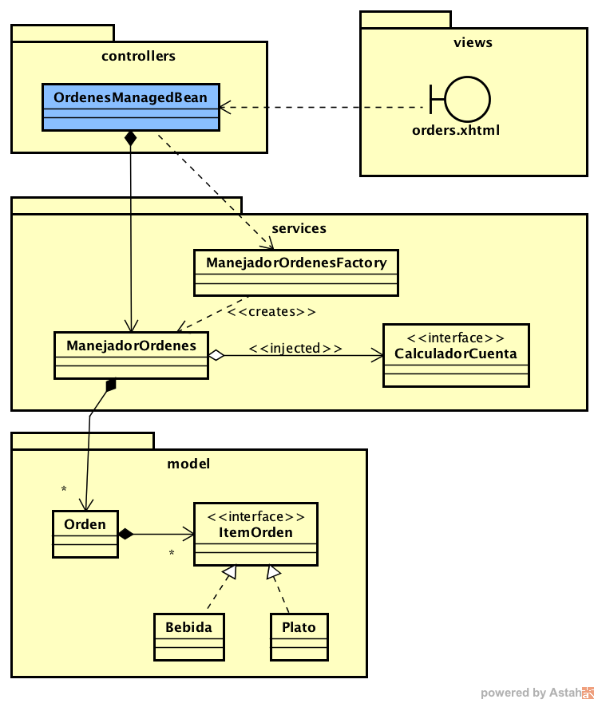

### Escuela Colombiana de Ingeniería

### Procesos de desarrollo de Software – PDSW

#### Frameworks Web MVC – Java Server Faces / Prime Faces

### Parte II

Ahora, va a realizar una aplicación (capa de presentación y control Web) que permita manejar los pedidos de un restaurante y el cálculo de las cuentas de los mismos, a partir del modelo realizado en uno de los ejercicios anteriores (basado en Google Guice), donde se desarrolló una 'capa' de servicios:

Para esto, clone el proyecto de ESTE respositorio, el cual ya tiene la configuración para usar JSF/Primefaces (tenga en cuenta que, además de copiar en éste los fuentes del ejercicio anterior, tendrá que agregar las mismas depedencias Maven).

1. La página debe mostrar una tabla donde se muestre:
    - Número de la orden.
    - Número de ítems asociado a la orden.

2. Debe tener un botón que permita crear una nueva orden vacía. Al seleccionar esta opción, se debería ver reflejada la nueva orden en la tabla anterior, con 0 ítems.

3. Se debe poder seleccionar una de las ordenes. Al hacer esto, en otra parte de la interfaz se debe:
    - Mostrar el detalle de los ítems asociados a la orden.
    - Mostrar el valor actual total de la orden.
    - Ofrecer una opción para agregar un nuevo ítem a la cuenta. Por ahora el modelo no contempla un catálogo de platos (ya que no hay una capa de persistencia), por lo que se deben ingresar los detalles cada vez: tipo de producto (bebida, plato), nombre y precio. Al agregar cada ítem, se debería recalcular y mostrar automáticamente el nuevo valor de la cuenta.
    
Para lo anterior revise:

Sección 3.33 del manual de PrimeFaces, en especial la página 159 que se
refiere a cómo capturar la selección de una tabla.
[*http://www.primefaces.org/docs/guide/primefaces\_user\_guide\_5\_2.pdf*](http://www.primefaces.org/docs/guide/primefaces_user_guide_5_2.pdf)

Para que la tabla del listado de productos, y la tabla correspondiente
al carrito de compras queden distribuidos de una forma organizada (y no
uno debajo del otro), revise el uso de éste en la sección 3.64 del mismo
manual, o a través de las demostraciones disponibles en:

[*http://www.primefaces.org/showcase/ui/panel/layout/element.xhtml*](http://www.primefaces.org/showcase/ui/panel/layout/element.xhtml)

Para el ejercicio anterior tenga también en cuenta:

- para la organización de las clases, use el esquema de paquetes del diagrama anterior.
- La aplicación debería cambiar de comportamiento cuando se cambie la configuración del Contenedor Guice.
- El esquema de pruebas desarrollado debería seguir funcionando.